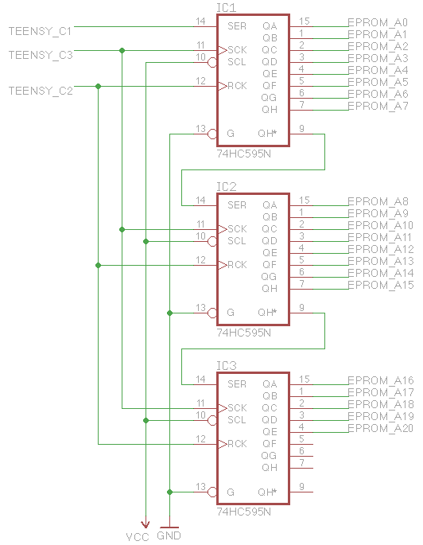
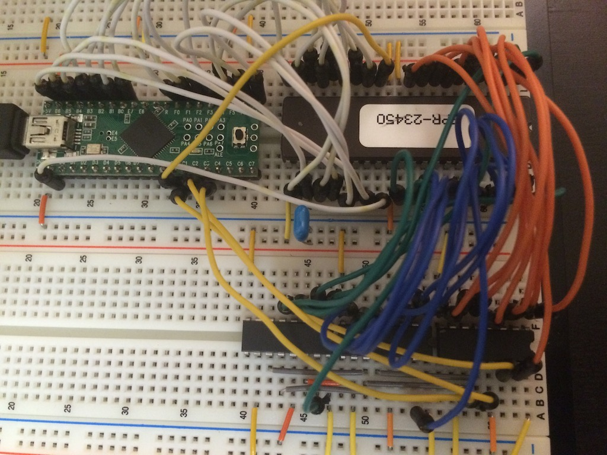

# EPROM Reader for Teensy++ 2.0

A simple EPROM reader for the [Teensy++ 2.0](https://www.pjrc.com/teensy/) AVR development board. Only 16 bit EPROMs supported so far. Tested with a 32 Mbit [M27C322](http://www.datasheetlib.com/datasheet/263291/m27c322_stmicroelectronics.html)。

## Components

- 1x Teensy++ 2.0
- 3x 74HC595 shift registers

## Usage

To read 32 Mb from the Teensy++ at /dev/ttyACM0:

    $ time ./eprom_reader.py -d /dev/ttyACM0 0 4194304 out2
    # Insert lots of dots scrolling by here...
     ./eprom_reader.py -d /dev/ttyACM0 0 4194304 out2  22.73s user 6.95s system 1% cpu 44:23.71 total

It takes over 44 minutes to read a 32 Mbit EPROM so it's definitely not the fastest thing out there. There is lots of room for improvement.

## Hooking it all up

| Description   | Teensy++ 2.0 Pin | EPROM Pin |
| ------------- | ----------------:| ---------:|
| Data 0-7      | F0-F7            | Q0-Q7     |
| Data 8-15     | B0-B7            | Q8-Q15    |
| Output Enable | C0               | G_n       |
| Chip Enable   | GND              | E_n       |

The shift registers are hooked up as per the schematic.

Here it is all hooked up.

